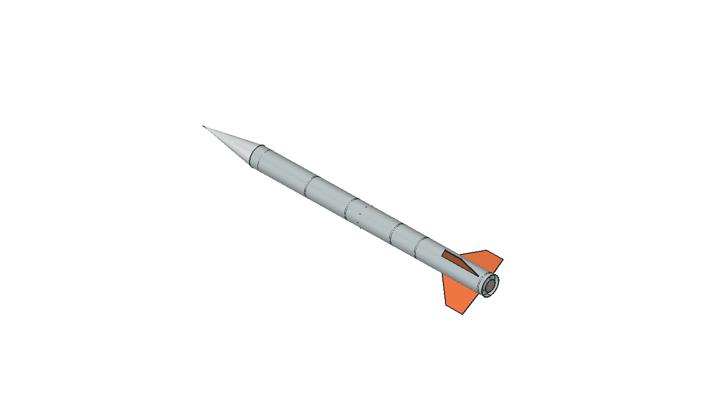

# PLBP–SG1 · Супер ГИРД

Результаты предварительного проектирования учебной ракеты. **База A04 · текущий CAD D01 · E02 / M01 / OR03 — предыдущие результаты · 1 октября 2026.**

## Посмотреть результат

- **[Полная ракета D01: целиком, в разрезе и разнесённо](model/full-d01/viewer.html)**.
- [Полный STEP D01](model/full-d01/PLBP-SG1-D01-FULL.step) · [что доработано](model/full-d01/README.md).

- **[Внутренний модуль E02 — предыдущая ревизия](model/internal-e02/viewer.html)** — 3D, материалы и раскрытие кассеты.
- **[Допмиссия M01](mission/m01/README.md)** — схема, алгоритм, компоненты и проверки.
- **[Расчёт OR03 для E02](simulation/or03/README.md)** — масса 5,932 кг, центровка и полёт.

- **[Презентация PDF — этап E02/M01](presentation/PLBP-SG1.pdf)** — краткая версия для команды.
- [PowerPoint](presentation/PLBP-SG1.pptx) · [автономная HTML-презентация](presentation/index.html).
- **[Интерактивная 3D-модель](model/viewer.html)** — вращение, просмотр компоновки, материалы и масса деталей.
- [Модель STEP для FreeCAD и других CAD](model/PLBP-SG1-A04.step) · [размерная схема PDF](model/layout.pdf).

- **[Внутренний модуль E01](model/internal-e01/README.md)** — 3D, размеры, материалы и детали для примерки.
- [15 дополнительных сценариев OpenRocket](simulation/or02/README.md) — влияние массы, поверхности и условий старта.

Для HTML нажмите **Download raw file**, сохраните файл и откройте его в браузере. HTML-презентация, три 3D-просмотра и интерактивный отчёт автономны: дополнительные файлы и интернет для просмотра не нужны. GitHub показывает HTML как исходный текст.

## Основные параметры

| Показатель | Текущий проект |
|---|---|
| Полезная нагрузка | 1,5 кг, отдельный макет со своим спасением |
| Расчётная стартовая масса D01 | 6.136 кг, включая полезную нагрузку |
| Длина / диаметр корпуса | 1570 / 100 мм |
| Стабилизаторы | Три, вынос 110 мм |
| Задача миссии | Выведение макета на высоту не менее 1000 м, возврат и сбор данных |
| Дополнительная миссия | Независимый поиск после посадки |

Готовы цифровая компоновка, модель, ведомость масс и предварительные расчётные оценки. Массы пока не измерены. Системы спасения, реальные соединения, электроника, прочность и полёт требуют дальнейшей разработки и испытаний. Расчётный двигатель — справочный образец; конкурсный тип ещё не подтверждён.

## Конкурсная база

В [ТЗ «Супер ГИРД» XV сезона](https://lk.aesa.tech/files/15/ТЗ%20для%20СГ%202026.pdf), п. 1.1.1, масса ракеты не ограничена. При этом PDF задаёт макет **1000 г**, а [страница чемпионата](https://aesa.tech/championship) — **1500 г**. Основной проект использует 1500 г; контрольный вариант 1000 г даёт стартовую массу 5,287 кг. Масса и габарит конкурсного макета требуют подтверждения.

Опубликованное положение относится к сезону 2025–2026. Правила следующего сезона и конкурсный допуск команды ещё не подтверждены. Текущая модель — результат цифрового проектирования, не готовое к полёту изделие.

## Полёт и центровка · OR01

[Модель OpenRocket и инструкция](simulation/README.md) · [интерактивный отчёт](simulation/report.html) · [ведомость масс](simulation/mass-properties.csv).

Пять тестовых сценариев: штиль, ветер 3 и 6 м/с, направляющая 3 м вместо 4 м, контрольный шаг 0,01 с. В штиль: апогей около **1514 м**, max q **26,48 кПа**, стартовый CG **940,3 мм** от носа. Масса и CG модели OpenRocket совпали с CAD; файл повторно загружен и пересчитан.

Результаты относятся к условным входным данным и подъёму до апогея. Отделение, спасение и посадка пока не моделируются. Для открытия нужны оба файла `.ork` и `.rse`; инструкция описывает импорт двигателя. Двигатель справочный, не согласованный с организаторами.

## Уточнение OR02 / E01

[15 дополнительных расчётных случаев](simulation/or02/README.md) · [крепления внутреннего оборудования](model/internal-e01/README.md). E01: прибавка 51,9 г, условная масса ракеты 5,839 кг. Геометрия проверена; соединения, ленты и обслуживание в собранном корпусе ещё открыты. Исходная A04 и OR01 сохранены. Новые расчёты — чувствительность до апогея, не подтверждение полётом.

## Предыдущая ревизия E02 / M01 / OR03

01.10.2026: [внутренние узлы E02](model/internal-e02/README.md), [дополнительная миссия M01](mission/m01/README.md), [расчёт OR03](simulation/or03/README.md). Текущая расчётная масса **5,932 кг** с макетом 1,5 кг. A04 и E01 сохранены как предыдущие варианты.

M01 — независимый звуковой поиск: цифровая кассета, кандидаты компонентов, цепи, программа и 17 программных проверок. Аппаратура ещё не собрана; акустический выход через закрытый корпус и зачёт миссии не подтверждены. ТЗ допускает собственный вариант допмиссии, который нужно согласовать.

Порядок следующего этапа: примерка компонентов → фиксация плат/батарей и корпусные стыки → проверка звука и давления → стенд автономности и удержания → полевые поисковые испытания. Геометрия и численный расчёт не заменяют эти проверки.

## Полная сборка D01

01.10.2026: [полная ракета](model/full-d01/viewer.html), [полный STEP](model/full-d01/PLBP-SG1-D01-FULL.step), [детализация и проверки](model/full-d01/README.md). 187 компонентов; расчётная масса 6.136 кг. Включён E02 и доработаны остальные отсеки. Старые массы/полёты E02/OR03 ниже относятся к предыдущему варианту.
