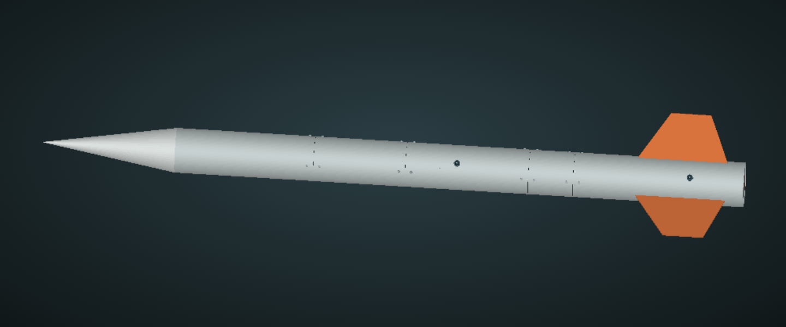
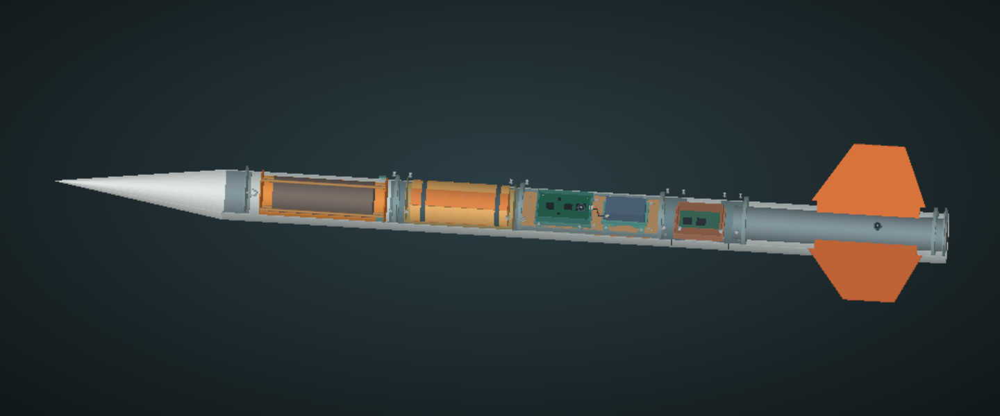

# D01 · полная детализированная ракета

**Полная сборка в миллиметрах, масштаб 1:1.** Это следующая цифровая ревизия после отдельного модуля E02. Внешние основные размеры: длина 1570 мм, корпус Ø100 мм, три стабилизатора с выносом 110 мм.

[Открыть полную 3D-модель](viewer.html) · [полный STEP](PLBP-SG1-D01-FULL.step) · [размерная схема PDF](layout.pdf) · [все детали и остатки бюджетов](parts.csv) · [масса по подсистемам](mass-totals.csv).

Просмотр работает без сети и библиотек. Режимы: целая ракета, продольный разрез, разнесение подсистем. Подсистемы можно скрывать; выбор отдельной детали приближает её. На GitHub сначала скачать HTML через Download raw file. В исходном проекте дополнительно выпущены нативные FreeCAD для полной сборки и разреза, с сохранённой историей построения.

## Реальная детализация этой ревизии

- **Корпус:** пять отдельных секций, четыре соединительные втулки, швы с прокладками, отверстия, винты с углублениями под ключ и ответные гайки. Их номинальная посадка проверена; резьба не моделируется, способ удержания гаек и рабочие нагрузки ещё не назначены.
- **Обтекатель:** полая оболочка, посадочная юбка, переборка, шайба и габарит рымового интерфейса. Соединение и система возврата требуют силовой проверки.
- **Полезная нагрузка:** оболочка Ø84×220, две съёмные крышки, четыре стойки и винты, опора и направляющие. Внутри явно сохранён резерв объёма/массы под собственную систему и балансировку. Это проект собственного макета, не утверждённая конструкция организаторов.
- **Спасение:** мешок, торцевые элементы, восемь условных складок купола и две ленты. Модель показывает расположение, но не предсказывает деформации ткани и раскрытие. Фалы, точки удержания и исполнительный механизм ещё не выпущены.
- **Электроника:** весь E02 включён в ракету. Основной борт и отдельный блок спасения получили корпуса, крышки и концептуальные платы размещения. Трасса основного питания показана двумя отдельными проводами с выходами через соединители. Основная схема и полный жгут остаются открытыми.
- **M01:** вместо простого габарита Feather использован [STEP Adafruit](CREDITS.md), включая USB-разъём, отверстия и электронные компоненты. Геометрия изготовителя не масштабировалась; её посадка в кассете проверена. Батарея, плата ключа и излучатель остаются в собственной кассете. Слышимость через корпус по-прежнему требует стенда.
- **Хвост:** моторная труба, кольца с технологическими отверстиями, ответная хвостовая плита и сквозные корневые части трёх стабилизаторов. Двигатель остаётся закрытым паспортным габаритом покупного изделия. Реальный удерживающий узел зависит от двигателя организаторов.
- **ПУ:** две площадки по кривизне корпуса, ползуны и крепёж. Размеры ползунов проектные; совместимость с реальной направляющей не объявлена.

## Масса и материалы

Текущая расчётная масса полной ракеты: **6.136 кг**, включая **1,5 кг полезной нагрузки**. Центр масс: **943.921 мм от вершины**. Изменение к E02: **+204.399 г**. Новые стыки, корни стабилизаторов и опоры имеют массу; высокая детализация не означает сохранение старой оценки 5,932 кг.

Плотности конструкционных деталей — допущения: стеклопластик 1,85 г/см³, полимер PETG 1,27 г/см³, условная сталь крепежа 7,85 г/см³. Для покупных сборок и ткани применяются назначенные массы, не плотность монолитного тела.

Бюджеты нагрузки 1500 г, основного борта 180 г, блока спасения 150 г и укладки 300 г распределены между деталями и явными остатками. Новые винты, гайки и показанные кабели выделены из прежних 120 г общего резерва. В `parts.csv` остатки имеют тип `unmodelled_allowance`; их нельзя добавлять второй раз. Массы не взвешены; распределение массы электроники и ткани ещё приблизительное. MassAudit — снимок этой ревизии: после изменения размеров пересчитать ведомость, она не обновляется автоматически от ручного редактирования.

## Проверено

187 компонентов, суммарно 244 отдельных твёрдых тел, включая тела из сборки производителя. Геометрия валидна; межкомпонентных объёмных пересечений нет. Нативный файл повторно открыт, видимость всех компонентов и трёх стабилизаторов проверена в GUI. STEP повторно импортирован с контролем количества тел и объёма. Изменение выноса пера через параметр и возврат исходного значения проверены.

Отдельные детали платы производителя учитываются как одна покупная сборка; внутренняя технологическая корректность её STEP не является нашей проверкой производства платы. Изображение высокой детализации не подтверждает силовую работоспособность ракеты.

## Что ещё открыто

Конструкция стыков и фиксация закладных гаек, удержание полезной нагрузки и двигателя, соединение корней стабилизаторов, силовые точки и фалы спасения, реальный полный жгут, испытания доступа/обслуживания, прочность и вибрация. Зазоры в CAD номинальные; реальные допуски материалов и печати ещё не учтены. Стыки и прокладки меняют утечки общего объёма — требуется повторная проверка канала давления самописца. Произвольный перенос отверстий не допускается без пересмотра измерительной схемы.

Предыдущие расчёты OR03 относятся к E02. D01 имеет новую ведомость массы и новые выступающие элементы; прежнюю высоту полёта нельзя приписывать D01 без обновления аэродинамической модели. Сегменты корпуса и разнесённый просмотр не определяют автоматически места/механизм отделения в полёте.
