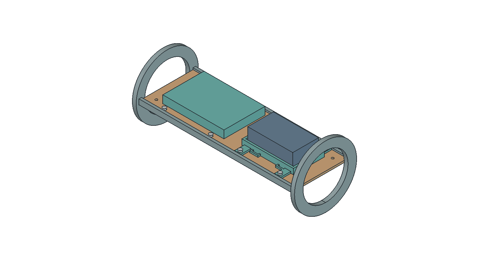
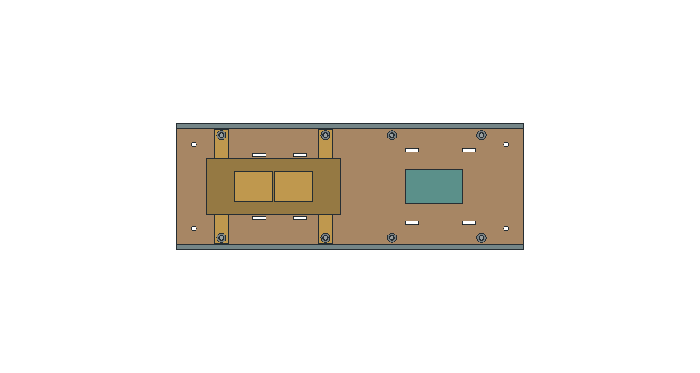

# E01 · примерочные крепления внутреннего оборудования

Геометрическая детализация A04: кассета самописца, держатель основной батареи, лоток с окнами и крепёж. **E01 — вариант для примерки; базовая ракета A04 ещё не заменена этим узлом.**

[STEP](PLBP-SG1-E01.step) · [интерактивный просмотр](viewer.html) · [схема интерфейсов PDF](interfaces.pdf) · [ведомость деталей](parts.csv) · [STL для примерки](fit-parts.zip).

## Размеры и интерфейсы

- Новый лоток: 240 × 80 × 3 мм; боковые опоры 240 × 4 × 8 мм. Окна уменьшают объём материала; механическая равноценность сплошному лотку пока не установлена.
- Самописец: полость 87 × 33 × 21 мм для максимального габарита 85 × 31 × 19 мм из номинала 84 × 30 × 18 ±1 мм. Прибор расположен около X=892 мм от носа; кассета оставляет номинально по 1 мм на сторону для максимального прибора. Допуск печати в этот запас ещё не включён.
- Кассета имеет боковые воздушные окна и решётчатую крышку; наружные 8×Ø1,6 мм A04 сохранены. Уложенная проводка, ленты и прокладки не должны перекрывать путь к реальному чувствительному элементу.
- Основная батарея: держатель под предварительный защищённый блок 70 × 40 × 22 мм, полость основания 74 × 42 мм, бортики 6 мм. Пазы лент в держателе и лотке согласованы. Батарея ещё не выбрана; держатель не предназначен для жёсткого сжатия незащищённой пакетной ячейки.
- Крепление держателей: по четыре M3; оси и номинальные отверстия приведены в PDF. Шляпки и гайки — упрощённые габариты, без резьбы, каталожной массы и подтверждённого затяжного усилия.

Ленты, мягкие прокладки, разъёмы и кабели не изображены как готовые узлы. Их артикулы, трассировку, фиксацию и испытания предстоит выполнить. Основной борт, поиск и их питание пока остаются габаритами; собственные крепления этих блоков ещё открыты.

## Масса без двойного учёта

Прежний лоток и две опоры: **126,78 г**. Новые неметаллические опоры, держатели и крышка: **178,72 г**. Прибавка к A04: **51,94 г**.

Условный крепёж по геометрии: 11,78 г. Он выделен из уже существующего 120-граммового резерва, а не прибавлен второй раз; нераспределённый остаток 108,22 г. Это пока бюджет для прочего крепежа, клея, кабелей, лент, прокладок и маркировки, не взвешенная комплектация.

С учётом E01 расчётная стартовая масса **5,839 кг**. В отдельном тесте OR02 апогей около 1505 м против 1514 м базы. Это проверка влияния массы; она не подтверждает удержание деталей в полёте.

## Материалы и проверки

PETG использован как кандидат для примерочных держателей, 1,27 г/см³ по [TDS производителя](https://storage.googleapis.com/prusa3d-content-prod-14e8-wordpress-prusament-prod/2023/10/9f8d2165-tds_prusament-petg_n_en.pdf). Масса считается для сплошной CAD-геометрии; реальная печать отличается. Паспортные свойства печатных образцов зависят от направления и режима, поэтому допускаемые напряжения для E01 не назначены. Лоток и опоры — условный стеклопластик 1,85 г/см³, как в A04; марка ламината ещё не выбрана. Для условного стального крепежа принята плотность 7,85 г/см³.

Проверены 29 отдельных валидных тел, отсутствие объёмных пересечений, радиальное размещение внутри Ø97 мм, максимальный габарит самописца, замкнутость сеток деталей, число тел и объём STEP. Нативный FreeCAD повторно открыт; видимость деталей проверена отдельно в GUI. Металлические тела здесь только условные крепёжные элементы.

**Проверка геометрии не заменяет испытания.** Не проверены прочность и ползучесть печати, удержание лентами, вибрация, соединение опор с лотком, фиксация лотка в корпусе и влияние температуры. В STL размеры в миллиметрах; это образцы для контроля посадки. Перед нагружением требуется проект соединений и технология, включая скругления кромок в местах лент/проводов.

## Обслуживание и следующая проверка

На извлечённом лотке батарея доступна сверху после снятия двух лент; самописец — снизу после снятия лент и крышки. **Способ извлечения лотка из собранной ракеты ещё не спроектирован.** Поэтому норматив замены батареи за пять минут не объявлен выполненным. Разъём корпуса и доступ к крепежу — приоритет следующей ревизии.

План примерки: проверить калибром 85×31×19 мм зазоры самописца и выход кабеля; собрать крепёж с реальными шайбами/гайками; проконтролировать зазоры до плат; проложить проводку с разгрузкой; убедиться, что батарея не нагружается через выводы. Затем измерить время обслуживания и провести стендовые проверки фиксации с инертными массовыми макетами по согласованным нагрузкам.

Для канала давления — сравнительная запись с эталонным датчиком при одинаковом изменении окружающего давления. Постоянные времени из [OR02](../../simulation/or02/README.md) являются исследовательскими допущениями. Защита самописца от воздействий соседних отсеков и наружных аэродинамических ошибок остаётся отдельной задачей; [руководство PerfectFlite, раздел установки](https://www.apogeerockets.com/downloads/PDFs/StratoLoggerCF_manual.pdf) используется как инженерная справка, а геометрию конкурсного самописца задаёт ТЗ ВИШ.
