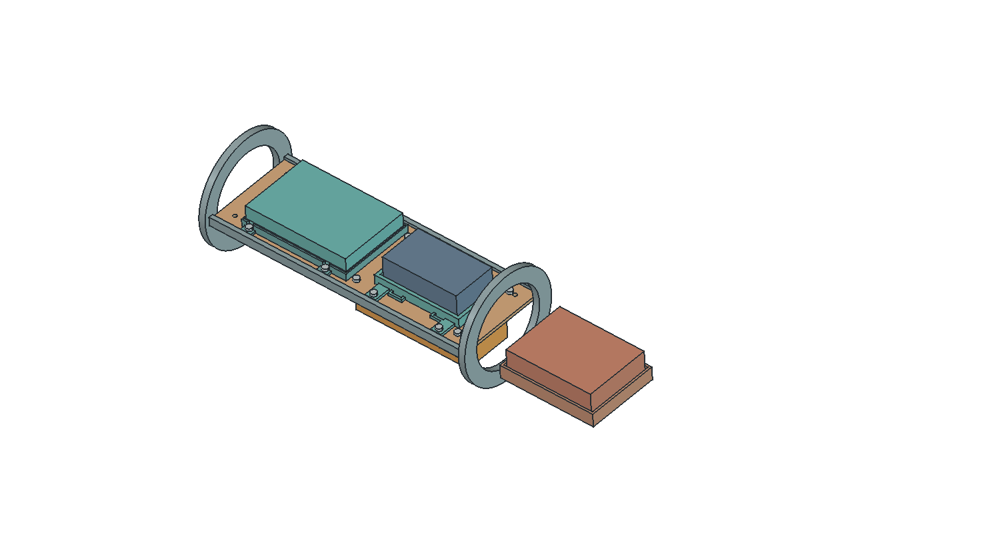
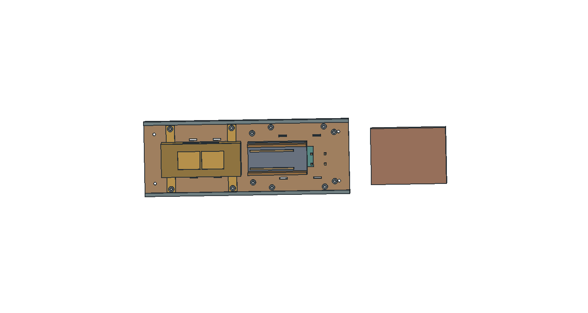

# E02 · внутренняя компоновка и миссия M01

**Цифровой примерочный вариант от 01.10.2026.** 55 тел проверены; физические соединения и полётная пригодность не подтверждены. Внешняя геометрия A04 сохранена.

[3D с материалами и открытием кассеты](viewer.html) · [STEP](PLBP-SG1-E02.step) · [схема интерфейсов, 2 страницы](interfaces.pdf) · [детали и массы](parts.csv) · [полный реестр внутренних зон](internal_interfaces.csv) · [STL для примерки](fit-parts.zip).

## Что уточнено

Основной борт получил собственный держатель и поднят над общим крепежом кассеты самописца. Под лотком размещён независимый звуковой модуль M01: корпус с внутренними акустическими окнами, отдельный ложемент батареи, опоры контроллера и платы ключа. Добавлен держатель габарита блока управления спасением. Разведены крепёж M01 и гайки держателя основной батареи.

Самописец проверен по максимальному габариту 85×31×19 мм. Батарея M01 — по чертежу изготовителя, 62,3×35,3×5,3 мм; ширина на странице магазина отличается от TDS. Проверен и увеличенный габарит звукового излучателя Ø12,6×10,7 мм. Детали и привязки приведены в PDF и CSV. Электроника показана габаритами, без утверждённой разводки PCB.

## Масса без двойного учёта

| Статья | г | Основание |
|---|---:|---|
| База A04 | 5787,092 | Прежняя расчётная ведомость, включая 120 г резерва |
| Удалены прежние лоток и опоры | −126.782 | Заменены новыми деталями |
| Новые неметаллические опоры и держатели E02 | +271.481 | Сплошная геометрия × назначенная плотность |
| Итого E02 | 5931.791 | Не взвешенная ракета |

Прирост к A04: **144.699 г**; к E01: **92,760 г**. Условный металлический крепёж 17.665 г выделен из прежнего 120-граммового резерва; остаток 102.335 г, а не новая добавка. Нельзя прибавлять его повторно.

M01 сохраняет прежние 80 г электроники и 40 г питания: контроллер 10 г (назначено), BZ1 1,6 г (каталог), плата ключа 4 г (назначено), остаток электроники 64,4 г; ячейка 23 г (каталог), остаток питания 17 г. Держатели добавлены отдельно. Блок спасения 150 г уже входил в A04. CSV геометрии содержит только показанные тела, поэтому его сумма не равна массе всей ракеты.

Материалы: PETG для примерочных держателей, 1,27 г/см³; условный стеклопластик лотка и опор 1,85 г/см³; условная сталь крепежа 7,85 г/см³. Это принятые плотности; свойства и допустимые напряжения лётного изделия не назначены. Фактическая масса печати, провода, прокладки и соединения требуют взвешивания.

## Полная карта внутренних зон

Реестр охватывает обтекатель и стык, полезную нагрузку, её упор, спасение, электронику, отдельный контроллер спасения и двигатель. Для каждой зоны указаны габарит, интерфейс и незакрытая проверка. **Подробно смоделированы держатели электроники; остальные зоны не объявлены готовыми узлами.**

Главные незакрытые интерфейсы: стык и извлечение лотка из корпуса, фиксация колец/опор, удержание полезной нагрузки, фалы и силовые точки спасения, крепление отдельного контроллера, удержание и тепловой режим двигателя. Мягкие прокладки, застёжки крышки M01, фиксация платы и жгуты пока не выпущены. Условные M3 не заменяют выбор реальных винтов, шайб и гаек.

## Проверки и следующий этап

Валидность 55 тел, отсутствие пересечений, размещение внутри Ø97 мм, максимальные габариты, STEP и замкнутость STL проверены автоматически. Нативный документ повторно открыт в GUI: материалы, плотности, видимость и MassAudit сохранены. Это проверка цифровой геометрии, без прочности и вибрации.

Сначала примерка реальных компонентов и прокладок; затем фиксация платы/крышки, проект корпусных соединений и обслуживания; далее стенд удержания и проверка давления. У M01 пока нет подтверждённого акустического и оптического пути через внешний корпус. Не добавлять порт в общий объём самописца без повторной проверки канала давления.
