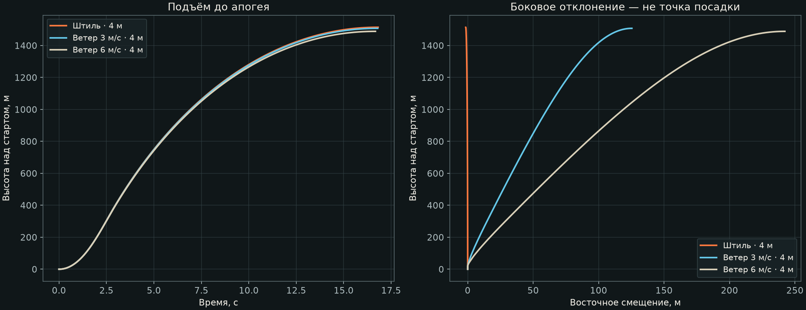
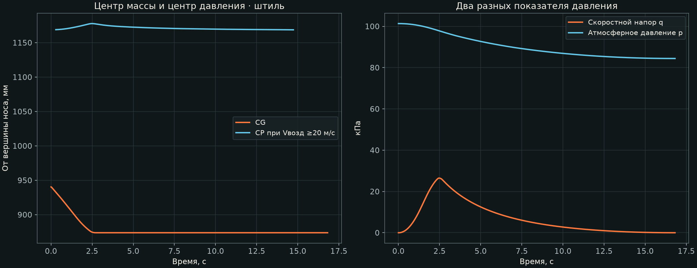

# Полёт, центровка и давление · A04 / OR01

**Тестовый расчёт OpenRocket 24.12, до апогея. Полезная нагрузка 1,5 кг.** Площадка, реальная направляющая и двигатель организаторов неизвестны. Это предварительные сценарии, а не прогноз согласованного пуска.

- [Интерактивный отчёт с графиками](report.html): скачать файл и открыть в браузере; данные встроены.
- [Модель OpenRocket](PLBP-SG1-A04-OR01.ork) и обязательный [справочный двигатель](K535W-REF.rse).
- [Краткая таблица результатов](summary.csv) · [ведомость масс и центров деталей](mass-properties.csv).
- Полные временные ряды: [штиль](calm.csv), [ветер 3 м/с](wind3.csv), [ветер 6 м/с](wind6.csv), [направляющая 3 м](short_guide.csv), [шаг 0,01 с](fine_step.csv).

## Открытие и повторный расчёт

1. Установить [официальный OpenRocket 24.12](https://github.com/openrocket/openrocket/releases/tag/release-24.12). Готовый пакет содержит Java.
2. Сохранить `.ork` и `.rse`. Поместить `.rse` в папку пользовательских кривых тяги: в **Edit → Preferences → General → User-defined thrust curves** добавить папку с этим файлом. Перезапустить OpenRocket, чтобы он прочитал базу двигателей. В 24.12 кривая не встроена в `.ork`.
3. Открыть `.ork`. В конфигурации двигателя должен быть **PLBP Reference / K535W-REF**. Не подменять его одноимённым мотором из другой базы: это изменит исходные данные. Если программа сообщает об отсутствующем двигателе, сначала проверить импорт `.rse`.
4. Во вкладке **Flight simulations** сохранены пять сценариев с результатами. Выделить сценарий, выбрать **Run simulations**. Для графиков — **Plot / export**: CG location, CP location, stability margin, air pressure, Mach number и другие параметры.
5. Во вкладке **Simulation options → Simulation extensions** используется **Java class: info.openrocket.core.simulation.listeners.system.ApogeeEndListener**. Этот класс входит в официальный OpenRocket 24.12; дополнительный плагин не нужен. Он останавливает расчёт после обнаружения апогея. Удалять его имеет смысл только после разработки и добавления спасения.

Модель повторно открыта и пересчитана в новом процессе официального ядра 24.12. Предупреждение **“No recovery device defined in the simulation”** ожидаемо: объём спасения учитывается как масса, действующий парашют ещё не задан. Это предупреждение сохранено, а не скрыто.

## Что заложено в модель

| Вход | Принято для теста |
|---|---|
| Геометрия | A04: длина 1570 мм, Ø100 мм; конический нос 300 мм; 3 стабилизатора 200/90/70/110 × 3 мм |
| Стартовая масса / после выгорания | 5,787092 / 5,042092 кг, включая макет 1,5 кг |
| CG от вершины на старте / после выгорания | 940,325 / 873,735 мм |
| Материалы оболочек | Стеклопластик 1850 и полимер 1270 кг/м³ — принятые плотности, не измерения |
| Модель атмосферы | ISA, высота старта 0 м; стандартные 288,15 K и 101325 Па у уровня моря |
| Условные координаты | 45° с. ш., 0° долготы; сферическая Земля; это не предлагаемая площадка |
| Направляющая | Вертикально; 4 м эффективного направленного хода, отдельный тест 3 м |
| Ветер | Постоянный 0 / 3 / 6 м/с, направление потока 90° в соглашении OpenRocket; турбулентность 0 |
| Численный шаг | Максимальный шаг 0,02 с; контроль 0,01 с. Внутренние адаптивные шаги могут быть меньше |
| Поверхность | Normal; профиль стабилизаторов Square; реальные дефекты и выступающие крепления не определены |
| Массовая модель | Масса и CG каждой детали из CAD/ведомости; внутренние блоки заменены цилиндрическими сосредоточенными массами |
| Область расчёта | Одна жёсткая сборка до апогея; макет удерживается внутри |

Длина 4 м — условный эффективный ход. Реальная полезная длина рельса, положение направляющих элементов и их аэродинамика требуют согласования. В этой ревизии геометрия направляющих элементов не добавлена.

Внешняя аэродинамическая форма перенесена в компоненты OpenRocket. Массовые поправки отдельных деталей обеспечивают совпадение массы и продольного CG с CAD; фиксированная масса всей ракеты не задавалась. Поэтому расход двигателя сдвигает CG. Моменты инерции внутренних блоков приближённые; малое поперечное смещение CG около 0,254 мм сохранено в массовой модели, но это не доказывает полную модель динамики асимметрии.

## Двигатель — только справочный вход

Файл **K535W-REF.rse** содержит оцифрованную кривую коммерческого AeroTech K535W из [брошюры производителя](https://d3l66gvjdr7rqw.cloudfront.net/Templates/170652/myimages/dms%20brochure%202021-ldrs-39%20small_1656455641142.pdf). Это не сертифицированный файл и не выбор конкурсного двигателя. Масса загруженного двигателя 1264 г, расходуемая масса 745 г, Ø54 × 358 мм взяты как проектный справочный вариант; [карточка производителя](https://aerotech-rocketry.com/products/product_79e0eada-ff52-f94c-c6ad-1fdd480dbc43).

Интеграл оцифрованной кривой **1422,716 Н·с**, паспортный ориентир 1434 Н·с: расхождение −0,79%. Растровая оцифровка даёт пик около 712 Н вместо каталожных 655 Н; следовательно, расчёт ускорений и схода особенно чувствителен к замене исходной кривой. Таблица заканчивается на 2,765625 с. Расход массы считается пропорциональным накопленному импульсу, CG двигателя принят посередине корпуса и не перемещается внутри него. Событие вышибного заряда не моделируется. Геометрия двигателя внутри и его изготовление не входят в проект этой интеграции.

## Результаты

| Тест | Апогей, м | max q, кПа | Скорость схода, м/с | Смещение у апогея, м |
|---|---:|---:|---:|---:|
| Штиль · 4 м | 1514 | 26,48 | 29,3 | 1,5 |
| Ветер 3 м/с · 4 м | 1508 | 26,50 | 29,3 | 125,2 |
| Ветер 6 м/с · 4 м | 1489 | 26,55 | 29,3 | 241,9 |
| Ветер 3 м/с · 3 м | 1507 | 26,50 | 25,6 | 133,5 |
| Штиль · шаг 0,01 с | 1514 | 26,48 | 29,3 | 1,5 |

Высоты даны над стартом. **Смещение у апогея не является местом посадки.** Для 6 м/с минимум расчётного запаса после схода при Vвозд ≥20 м/с составляет 1,515 диаметра, максимальный угол атаки в этом интервале — 11,5°. Это требует проверки динамики и применимости аэродинамической модели; отсутствие предупреждения симулятора не означает допуск. Неизвестная турбулентность и порывы в этих пяти сценариях отсутствуют.

В штиль max q = **26,48 кПа** при t ≈ 2,47 с, h ≈ 298 м. Максимальное число Маха 0,622. Атмосферное давление у апогея около 84,41 кПа.

## Центр масс, центр давления и запас

CG = Σ(mᵢxᵢ)/Σmᵢ. Координата x отсчитывается от вершины носа к хвосту. На старте CG = 940,325 мм; после выгорания 873,735 мм: расход массы сзади смещает центр вперёд. В [ведомости](mass-properties.csv) каждая деталь и двигатель учтены один раз; суммарно 5,787092 кг. Макет 1,5 кг — часть этой массы.

CP — точка результирующей нормальной аэродинамической силы в принятой модели. **CP не постоянен.** В статической оценке OpenRocket при M=0,05, α=0°, азимуте потока 0°: CP = **1168,8 мм**, запас (CP−CG)/D = **2,285 D**, где D=100 мм. Предыдущая ручная низкоскоростная оценка давала 1168,8 мм и 2,285 D; это другой уровень приближения, её не подгоняли к OpenRocket.

| Число Маха | Угол атаки, ° | CP от носа, мм | Запас при стартовом CG, D |
|---|---:|---:|---:|
| 0,05 | 0 | 1168,8 | 2,285 |
| 0,05 | 5 | 1124,7 | 1,844 |
| 0,05 | 10 | 1092,3 | 1,520 |
| 0,30 | 0 | 1170,5 | 2,302 |
| 0,30 | 5 | 1126,4 | 1,861 |
| 0,30 | 10 | 1094,0 | 1,537 |
| 0,60 | 0 | 1176,8 | 2,365 |
| 0,60 | 5 | 1132,8 | 1,924 |
| 0,60 | 10 | 1100,2 | 1,599 |

Положительный статический запас сам по себе не подтверждает устойчивость на направляющей, при порывах, больших углах атаки, отделении или флаттере. В графиках CP скрыт при Vвозд <20 м/с, чтобы низкоскоростную область возле апогея не принимать за надёжный показатель; исходный CSV сохранён полностью.

## Давление: три разных величины

- **Атмосферное p**, Па: давление окружающего воздуха. Меняется с высотой; для нагрузки на замкнутую оболочку нужна разность наружного и внутреннего давления. Внутреннее давление, продувка вентиляционных отверстий и переходные процессы не рассчитаны.
- **Скоростной напор q = ½ρVвозд²**, Па: масштаб аэродинамических нагрузок. Использована скорость относительно воздуха `Mach × speed_of_sound`, а не скорость относительно земли. График q не показывает локальную нагрузку каждой точки корпуса.
- **Местное давление на поверхности** требует распределения коэффициента давления, CFD или испытаний. Его здесь нет. Центр давления CP — координата, а не величина давления. Давление в двигателе не является входом этого расчёта: двигатель задан готовой кривой тяги.

## Проверки и пределы точности

Повторная загрузка `.ork` + `.rse`: без предупреждений загрузчика; пять сценариев пересчитаны; массы и продольный CG совпали с CAD до 10⁻⁸ кг/м. Это проверка переноса данных, а не точность реального изделия. Полные CSV проверены на конечность основных величин, физические знаки и массу после выгорания. Остановка после апогея сохранена в файле и повторно проверена.

При изменении шага 0,02 → 0,01 с изменение апогея составляет **0,0161 м** (0,00107%), max q — **0,402 Па**. Сравнение двух шагов даёт оценку чувствительности; оно не устанавливает порядок сходимости и не подтверждает реальный полёт.

Автоматический контроль использует seed **20260930**. В 24.12 seed не сохраняется в формате `.ork` 1.10, а ядро добавляет малые случайные моменты даже при нулевой турбулентности; повтор в GUI может немного отличаться. Сохранённые данные в `.ork` соответствуют приложенным CSV. Пакет не зависит от внешнего кода для остановки на апогее: использован штатный класс симулятора.

Это шестистепенная модель жёсткого тела с инженерной аэродинамической моделью OpenRocket, а не CFD, прочностной анализ или модель гибкой конструкции. Старый вертикальный расчёт при заданных Cd остаётся отдельной оценкой чувствительности и не смешан с новой таблицей. Отделение 1,5 кг и два парашюта нужно разработать до расчёта спуска и зоны посадки.

Для повышения достоверности нужны: согласованный двигатель с проверенной кривой тяги/массы; измеренные масса, CG и инерция сборки; реальная направляющая; метеопрофиль; геометрия креплений; стендовые проверки отделения и раскрытия; сопоставление расчёта с телеметрией испытаний.

Источники методов: [документация OpenRocket](https://openrocket.readthedocs.io/en/latest/user_guide/advanced_flight_simulation.html), [техническое описание](https://openrocket.sourceforge.net/techdoc.pdf), [штатная остановка на апогее в 24.12](https://github.com/openrocket/openrocket/blob/release-24.12/core/src/main/java/info/openrocket/core/simulation/listeners/system/ApogeeEndListener.java). Документация latest может описывать функции новее 24.12; данный файл проверен именно в 24.12.

CSV: все заголовки содержат SI-единицы; `aoa_rad` и угловые скорости — радианы, `stability_cal` — диаметры корпуса, `cg_m`/`cp_m` — от носа, `east_m`/`north_m` — локальное смещение, `ground_speed_m_s` — полная скорость относительно земли, `air_speed_m_s` — относительно воздуха. `q_Pa` вычислен из выходов атмосферы и числа Маха OpenRocket; остальные столбцы — выходы симулятора. Больше знаков в CSV нужно для воспроизводимости, а не для обещания такой точности.

## Расширение OR02

[Новая серия из 15 расчётных случаев](or02/README.md): поверхность, температура, высота площадки, запас массы, профили ветра и примерочный E01.
