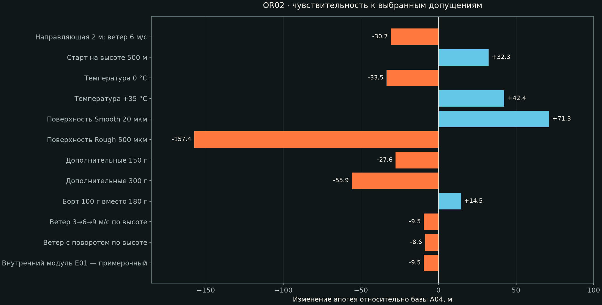
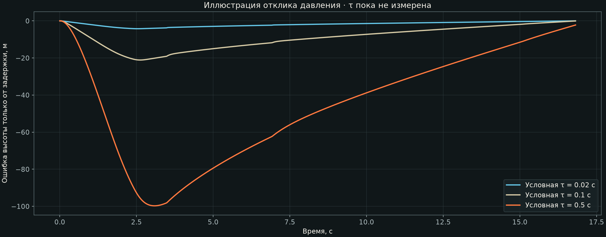

# OR02 · чувствительность полёта и измерений

15 новых расчётных случаев OpenRocket 24.12, включая повтор базы A04 и отдельный примерочный E01. Вместе с OR01 сохранены 20 случаев; повторная база не является независимым испытанием. **Все входы тестовые; расчёт до апогея.**

[Скачать модели, CSV и параметры одним архивом](OR02-models.zip) · [таблица CSV](summary.csv) · [базовая инструкция OpenRocket](../README.md).

Распаковать архив, импортировать `K535W-REF.rse` по базовой инструкции и открыть нужный `.ork`. Каждый файл содержит свой вариант массы/поверхности и одну симуляцию. Это предотвращает перенос изменённой массы на чужой сценарий. Остановка на апогее — штатный ApogeeEndListener; внешние плагины не нужны.

## Что изменяется

База: A04, нагрузка 1,5 кг, справочный K535W-REF, 4 м эффективного хода направляющей, ISA у уровня моря, 15 °C, ветер 0, Normal 60 мкм. Шаг 0,02 с; seed автоматической проверки 20260930.

- Температура: 0 и +35 °C при 101325 Па и высоте старта 0 м; используется расширенная ISA с заданными условиями у старта.
- Высота площадки: 500 м над уровнем моря; апогей в таблице отсчитывается от этой площадки. Это отдельный тест, не реальное место запуска.
- Поверхность: Smooth 20, Normal 60, Rough 500 мкм — параметры модели OpenRocket 24.12. Они не являются измеренным Ra нашего корпуса.
- Запас: дополнительные 150/300 г в X=950 мм. Облегчённый борт: 100 г вместо назначенных 180 г, без выбранного BOM. Это условное изменение, не подтверждённая экономия.
- Макет 1 кг: контроль расхождения сайта и PDF ВИШ; основной проект по-прежнему 1,5 кг.
- Профиль ветра: уровни 0/500/1500 м над уровнем моря, скорости 3/6/9 м/с. Во втором профиле направления 90/120/150° в соглашении OpenRocket. Между уровнями работает штатная интерполяция; за крайними уровнями — крайнее значение. Высота площадки в обоих профилях 0 м. Турбулентность 0: это сдвиг ветра, а не случайные порывы.
- Сочетание тяжёлых условий: 2 м направляющей, 6 м/с постоянного ветра, +300 г и Rough. Это выбранный стресс-сценарий, а не наихудшее возможное состояние и не статистический предел.
- E01: реальные массы новых внутренних деталей, замена старого лотка/опор и выделение крепежа из прежнего резерва. Массовая модель проверяется отдельно от готовности этих креплений к полёту.

## Результаты

| Случай | Старт, кг | Апогей, м | Δ к базе, м | max q, кПа | Сход, м/с |
|---|---:|---:|---:|---:|---:|
| База A04 | 5,787 | 1514 | 0,0 | 26,48 | 29,3 |
| Направляющая 2 м; ветер 6 м/с | 5,787 | 1484 | -30,7 | 26,56 | 21,1 |
| Старт на высоте 500 м | 5,787 | 1547 | 32,3 | 25,46 | 29,3 |
| Температура 0 °C | 5,787 | 1481 | -33,5 | 27,54 | 29,3 |
| Температура +35 °C | 5,787 | 1557 | 42,4 | 25,19 | 29,3 |
| Поверхность Smooth 20 мкм | 5,787 | 1586 | 71,3 | 27,01 | 29,3 |
| Поверхность Rough 500 мкм | 5,787 | 1357 | -157,4 | 25,14 | 29,3 |
| Дополнительные 150 г | 5,937 | 1487 | -27,6 | 25,24 | 28,9 |
| Дополнительные 300 г | 6,087 | 1458 | -55,9 | 24,08 | 28,5 |
| Контрольный макет 1 кг | 5,287 | 1600 | 86,2 | 31,16 | 31,0 |
| Борт 100 г вместо 180 г | 5,707 | 1529 | 14,5 | 27,17 | 29,8 |
| Ветер 3→6→9 м/с по высоте | 5,787 | 1505 | -9,5 | 26,53 | 29,3 |
| Ветер с поворотом по высоте | 5,787 | 1506 | -8,6 | 26,52 | 29,3 |
| Сочетание тяжёлых условий | 6,087 | 1286 | -228,5 | 23,04 | 20,3 |
| Внутренний модуль E01 — примерочный | 5,839 | 1505 | -9,5 | 26,04 | 29,1 |

В выбранном диапазоне влияние поверхности больше, чем условная экономия 80 г на борте. Из этого не следует универсальный приоритет полировки: реальная шероховатость и Cd ещё не измерены. Уменьшение массы повышает также скорость и скоростной напор; его нельзя оценивать только по высоте.

У случая «2 м + ветер 6 м/с» минимум запаса после схода при Vвозд≥20 м/с — 1,296 D, максимальный угол атаки в этом интервале 15,9°. У комбинированного случая — 1,267 D и 16,4°. Эти числа отмечают чувствительные условия; они не доказывают допустимость пуска. Погрешность инженерной аэродинамической модели при таких углах может быть существенной.

## Условная задержка измерения давления

Отдельная модель первого порядка `dpдатчика/dt = (pвоздуха − pдатчика)/τ` наложена на атмосферное давление базовой траектории. Постоянные времени **0,02 / 0,1 / 0,5 с выбраны для сравнения**, а не рассчитаны по отверстиям и не измерены. Ошибка получена одинаковым ISA-преобразованием обоих давлений в высоту, поэтому сравнение выделяет именно задержку. Обработка сигнала прибора, шум и местные аэродинамические ошибки не учтены.

Максимальные ошибки для выбранных τ: 4,2 м, 21,1 м, 99,7 м. Эта модель объясняет необходимость стендового сравнения с эталонным датчиком; она не даёт рекомендацию менять восемь отверстий из ТЗ ВИШ.

## Проверки и ограничения

Все 15 `.ork` повторно загружены официальным ядром без предупреждений загрузчика. Проверены сохранённые массы, CG, профили ветра и временные ряды; пять репрезентативных случаев повторно рассчитаны, включая оба профиля ветра, сочетание условий и E01. При том же seed апогей воспроизвёлся. Кривая тяги и ограничения её оцифровки те же, что в OR01. Штатное предупреждение об отсутствии спасения ожидаемо и не скрыто.

Отделение макета, парашюты, посадка, флаттер и прочность не моделируются. Малый набор детерминированных сценариев не задаёт вероятность успеха или область гарантированных параметров. Seed в `.ork` 1.10 не сохраняется, поэтому повтор в GUI может немного отличаться. Полные условия — в `cases.json` внутри архива.

Источники: [масса и поверхность OpenRocket](https://openrocket.readthedocs.io/en/latest/user_guide/overrides_and_surface_finish.html), [шероховатость в коде 24.12](https://github.com/openrocket/openrocket/blob/release-24.12/core/src/main/java/info/openrocket/core/rocketcomponent/ExternalComponent.java), [многоуровневый ветер 24.12](https://github.com/openrocket/openrocket/blob/release-24.12/core/src/main/java/info/openrocket/core/models/wind/MultiLevelPinkNoiseWindModel.java).
